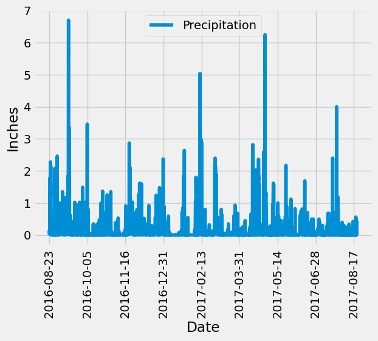
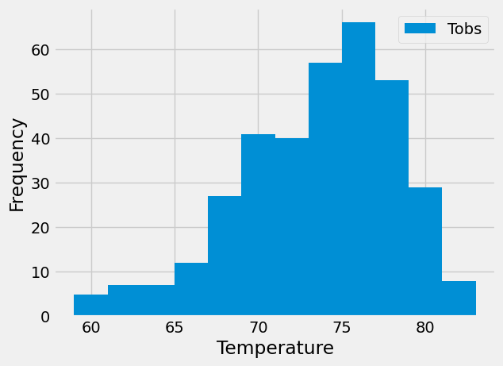

# SQLAlchemy Challenge
Python and SQLAlchemy to do a basic analysis and data exploration of sqlite climate database

## Introduction
Using SQLAlchemy, Jupyter notebook, and Flask weather data stored in a sqlite database for Honolulu, Hawaii has been analyzed. The precipitation amount for a year and a temperature histogram were plotted. These plots revleaded the most common temperatures and times of the year with the least amount of rainfall, at least for 2016/2017. Additionally, a simple flask webapp was developed to expose some of the data stored in the sqlite database as JSON objects.

   